Here are some Frontend Development resources that have proven useful

## Sitecore Experience Accelerator

<details>
<summary>Horizontal SXA FED / BED Findings</summary>
<br />  

[Lixil-Related FED Findings](https://horizontal.atlassian.net/wiki/spaces/LWTA/pages/800718849/Lixil+-+Bootstrap+SXA+Learnings+and+Findings)
 
[Lixil-Related BED Findings](https://horizontal.atlassian.net/wiki/spaces/LWTA/pages/802652352/SXA+POC+Findings)
 
[Even more Lixil-Related SXA Notes](https://horizontal.atlassian.net/wiki/spaces/LWTA/pages/814514694/SXA)
 
# Some other notes for UX/Content teams:
 
## What is SXA?
SXA (Sitecore Experience Accelerator) is a module developed by Sitecore and comes with Sitecore 9.0 and up.
[Features](https://doc.sitecore.com/users/sxa/17/sitecore-experience-accelerator/en/introducing-sitecore-experience-accelerator.html)
Tenants and sites (Set up tenants, multisites, security roles)
Toolbox (reusable renderings you can drag and drop)
Grid and column layout (ability to configure rows and columns)
Pluggable themes (enable available themes or use your own custom brand themes)
Page designs and partial designs (define presentation for pages and partials)
Creative Exchange (ability to sync themes and content back to Sitecore environment)
Share content and presentation (allows you to control content from one central location and shared across sites)
Asset Optimizer (enable optimization on assets such as CSS/JS for improved site performance)
Data modeling (ability to model and access data via JSON API)
 
## Why should we use it?
SXA helps separate structure from design so designers, developers, and content authors can work in parallel to build, deploy, and maintain sites.
i.e. 
BED configures data and templates while
FED works on theming
Content author can enter content during this time and/or
UXD could assemble wireframes for initial layout and components
 
## How have we used it on Lixil?
We’ve spun up a base site with a base theme that is rolled out to all brand themes. Each brand theme then has its own custom brand CSS, which also inherits from the base theme. All components are also available across sites. Lixil is multisite and will be comprised of 4-5 brand sites down the road.
 
## What challenges has it solved for us?
Faster delivery - Using OOTB components reduces time of development.
Reusability - Has sped up production via reuse of components, layouts and templates. 
Commerce - Using SXA Commerce Storefront theme which speeds up development as well.
 
## What challenges do we still face from a FED perspective?
OOTB components don’t always come with all the features we need, so we have create and rely on variants to extend the rendering. This requires some extra dev (BED config & export, FED UI work).
Requires a lot of collaboration and communication between all teams to make decisions, implement, and validate.
Things that are not available:
Variant creation for carousel, accordion, 
Full card anchors (we’re just javascript to make it so)
OOTB SXA video component can’t be played in a popup
OOTB SXA navigation is restrictive so header/footer is custom
Still on Bootstrap 3.3.4 because Commerce Storefront does not support Bootstrap 4.
Encountered a lot of presentation/layout issues due to OOTB SXA component structure
OOTB code structure does not fully conform to Bootstrap grid in places.
Generating double .rows, too many chained classes, etc.
Issues with row splitters and column splitters getting too nested.
Must be really careful during component construction to not deeply nest items or,
Carefully tweak CSS to account for code structure that cannot be modified
Best Practices:
Start with a bare bones theme.
Avoid using row splitters and column splitters. Add components directly to a placeholder.
Use containers if more than one components needs to be added for a section like multiple/repeating promo cards.
For items inside .container > .row, make sure they include the bootstrap grid classes where necessary i.e. col-xs-12 col-md-6 col-lg-3
Make sure the component structure follows Bootstrap grid structure. i.e. 
```html
<div class=“container”><div class=“row”><div class=“col-xs-12”>…</div></div></div>
```
Add css class names to variants so FED can use this css to style them. Follow component naming convention as defined in functional requirements for consistency.
 
## What does UX need to know to get started?
Kathryn Deming and Lisa Albinson from the Minneapolis UXD team are great resources.
Get familiar with [OOTB components/rendering variants](https://doc.sitecore.com/users/sxa/17/sitecore-experience-accelerator/en/the-sxa-renderings-and-rendering-variants.html).
Check out the Lixil component requirements. Many are based on OOTB components which we’ve created variants for.  [Check it out](https://horizontal.atlassian.net/wiki/spaces/LWTA/pages/811599681/Components+Overview)!
 
## Resources
[Official Sitecore SXA Documentation](https://doc.sitecore.com/developers/sxa/17/sitecore-experience-accelerator/en/index-en.html)
[Lixil Content Guides](https://horizontal.atlassian.net/wiki/spaces/LWTA/pages/814711176/Release+Notes+Content+Guides )

```Note: Use the links in the left hand nav (instead of body conten on this page) to see individual content guides per component```
</details>
<br />
<details>
<summary>SXA Basics</summary>
<details>
<summary>Tenant and Site Creation</summary>
<br />  

Right-click on ```Content``` node and a dropdown menu will appear. From here, follow ```Insert > Tenant```. If your site will have numerous sub-sites, you can either create a ```Tenant Folder``` which can house multiple ```Tenants```, or you can create a ```Tenant``` which can also house multiple ```Tenants```. Each Tenant has a set of Data Templates, which are stored in the Templates section which you can share within a Tenant. You can also share Rendering Variants, Themes, and Media. Think first about how your organizational structure should be reflected, then click the button to make the thing.  

When you right click on ```Content``` then select ```Insert > Tenant``` a Tenant creation wizard will appear. It's magical. It is a single-step wizard, so it's not really that magical. But you should give your Tenant a name according to the naming conventions you have agreed upon with your client and or team, and additionally, you can select which of the Modules you may need for your Tenant.

Once you have created your Tenant, it will appear along the following path; ```sitecore > Content > *new_tenant_you_created*```. If you select your tenant, you will be able to explore all of the relevant paths for your tenant, available modules, shared site information. Once you have created this tenant, you will notice that in some places along your sitecore folder tree, that some new folders have been created. i.e. ```sitecore > Templates *new_tenant_you_created*```. In that folder there will be a bunch of Data Templates. Same for the Media Library, ```sitecore > Media Library > Project > *new_tenant_you_created*```.

Next, right-click on the ```*new_tenant_you_created*```, and you will see a menu similar to when you right-click on the ```Content``` in your folder tree. Under ```Insert``` there are options to create a Site, Site Folder, or Insert From Template. Click ```Insert > Site``` and the Site wizard will load. This wizard is more complex than the first one we met, this is a 4-tabbed wizard. He will ask you about General, Modules, Theme, and Grid. Be ready.

Under General > Site name, tell the 4-tabbed wizard the name of your site. You will do this by clicking into the Site name field, then using the keyboard to type the name of your site. i.e. My Super Awesome Sitecore SXA Website. In the Host name field, you will have to tell the 4-tabbed wizard the URL for your website, but it will also need to be bound and that's a thing that BED people do, so as the presenter does, just skip that $***. In the Virtual folder field, the 4-tabbed wizard is curious if you would like to store your files anywhere other than the site root. Just leave it alone. Same with the Language dropdown; if you want anything other than English, select that, otherwise, leave it alone.

Moving on to the second tab in our 4-tabbed wizard, Modules, here you can select the modules that you may want preconfigured for your site. This time, think about what Modules you actually want, because sitecore will make all of them if you want, but that's a lot of time and data which you may not need to waste or use. If you happen to make an improper selection or miss a Module, you can fix that later on.

Welcome to the third tab in our 4-tabbed wizard, Theme. You can create a new theme by clicking the checkbox labeled *Create a new theme*. There also exists a default theme called *Wireframe*. Check the *Create a new theme* checkbox and in the *New theme name* input field, tell the 4-tabbed wizard the name of your new theme.

And... we've made it to the fourth and final tab in our 4-tabbed wizard, Grid. By default, there are THREE grid options; Bootstrap, Foundation, and Grid 960. Just go with Bootstrap and click that little blue Ok button in the bottom-right corner of the 4-tabbed wizard and the new *My Super Awesome Sitecore SXA Website* site will generate. It may take a while, go get a La Croíx or take a nap. Do NOT do anything else or the 4-tabbed wizard will destroy your computer and most of the internet.

Phew, you dodged a something by following directions well. Click the little blue Close button and now you will see your *My Super Awesome Sitecore SXA Website* site underneath your previously created Tenant, i.e. ```sitecore > Content > *new_tenant_you_created* > My Super Awesome Sitecore SXA Website```. Inside of your My Super Awesome Sitecore SXA Website in the folder tree, you can see a whole bunch of folders that have been made by the 4-tabbed wizard for you! He made; Home, Media, Data, Presentation, and Settings folders! Home stores all of your webpages, Media stores media, Data stores all of the different Modules you selected earlier (these will act as a datasource for your website), Presentation stores the different files that control how your website looks and behaves, and finally Settings allows you to change a bunch of settings for your site (404 page, 500 server error page control lives here). Under ```sitecore > Content > *new_tenant_you_created* > My Super Awesome Sitecore SXA Website > Settings > Site Grouping > My Super Awesome Sitecore SXA Website```, you can find the settings that you defined with the 4-tabbed wizard *General* tab.

A Site will share datasources with its tenant, but you will have control over theme and a virtual folder for the site will exist independent of the tenant. If you should ever need to delete your site, you can rihght-click on the site name in the folder tree and under *Scripts*, click the *Remove site* option. This will run a script that removes all of the folders which are specific to the site which you would like to remove. The *Are you sure you want to delete My Super Awesome Sitecore SXA Website?* wizard will launch to confirm your decision. If you are certain, you may click the blue *OK* button, if you would like to thank this wizard for saving you from making an egregious error, click the grey *Cancel* button, and the wizards disappearance will serve as acknowledgement of both your thanks and your error. There is a similar option available for Tenants that you wish to remove from your sitecore instance. Follow the above steps and meet the wizard.

If you had deselected a module when running though any of the wizards you have met before *(either the tenant one-step wizard, or the site 4-tabbed wizard)* and would like to add a module to them, right-click on the name of the site or tenant and under the *Scripts* menu, there is a script called *Add Site module*. Click that. The Add site module wizard will appear to help you in your search to add modules. If you have made any custom modules for sitecore and placed them in your sitecore instance, they would be available in the add module wizard if you had not selected them when making a tenant or site.
</details>
<details>
<summary>SXA Partial and Page Design Basics</summary>
<br />  

*Within SXA, you can use partial and page designs to create your UX layout.*

After datasource architecture, partial and page designs is a likely first step. Follow this path ```sitecore > Content > *my_tenant_name* > *my_site_name* > Presentation > Page || Partial Designs```. Partial Designs, i.e. a Header or Footer, are combined to create a Page Design. Right-click on ```Partial Designs``` then find ```Insert > Partial Design```. In the partial design wizard, give your partial design a name, i.e. Header, then click ok. Your new partial design will appear in the folder tree, right-click on that then click ```Experience Editor```, this will open the *Experience Editor*.

Within the *Experience Editor* you can drag and drop components into your partial design. In the *Experience Editor*, you will see (in the main part of the screen) a field that looks like a canvas (grey and white checkboard patterned), this is where the components for your partial design will go. There is a *header*, a *main*, and a *footer* for each partial design and when the page is rendered, these sections will be rendered in that order. For example, if you are making a Header component, but place the components for the partial design in a section that is not the header, then your Header Partial Design will not render in the header of your page.

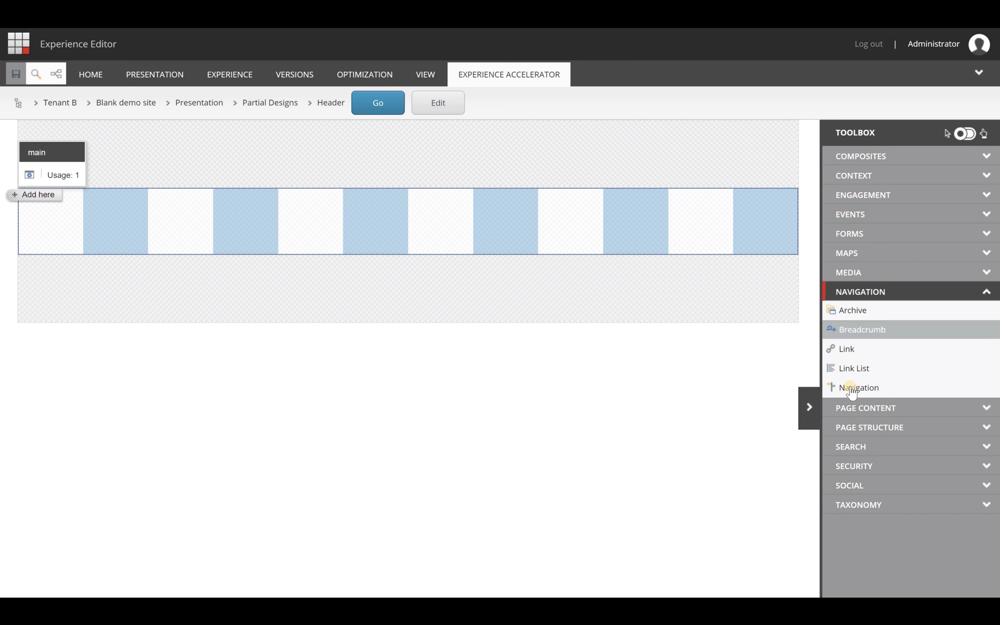
*SXA Experience Editor Canvas. The alternating white and blue squares are highlighting the *main* section of the partial design canvas area*

To add a component to the Header, drag the *Navigation* component from the right-hand side of the *Experience Editor* to the header section of the canvas. The *Navigation* component is nested under the *NAVIGATION* category of available components. Once the *Navigation* component is in the header section of the canvas, a toolbar for that component will appear (as seen below).

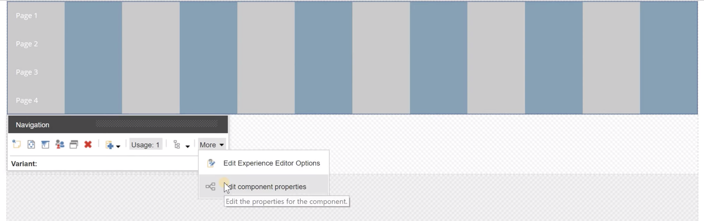
*SXA Experience Editor Navigation Component placed in header of Design Partial, toolbar active*

On the right-side of the toolbar for your placed component, there is a dropdown menu, labeled *More*, underneath which are additional options for your component. Click *More*, then click *Edit component properties* to open the *Control Properties* wizard. When the wizard opens, scroll to the bottom *Styling* section. Here you can change the style of your component. Under *Navigation*, click the *Big/Fat Navigation*, then scroll further to the *Navigation Settings* section of the wizard. In the *Navigation Settings* section of the *Control Properties* wizard you can adjust the levels of navigation. In the demo, the presenter changes the *Bottom Navigation Level* from the default of 2, to 1. Click the little blue *OK* button to save the changes to your component. You should now see a horizontal navigation. Click save.

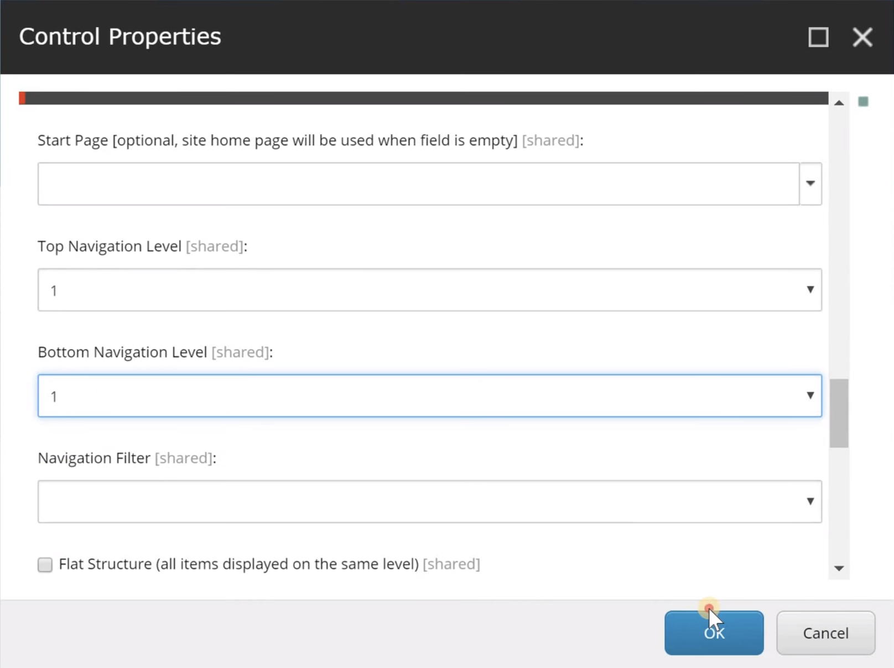
*SXA Experience Editor Component Control Properties Wizard showing the Navigation Settings settings*

Back in the main folder tree of your project, right-click on ```Partial Designs``` then find ```Insert > Partial Design```. In the partial design wizard, give your partial design a name, i.e. Footer, then click ok. Your new partial design will appear in the folder tree, right-click on that then click ```Experience Editor```, this will open the *Experience Editor*.

Try inserting a *Rich Text* component into the footer section of your footer partial design. The *Rich Text* component is in the *PAGE CONTENT* section on the right-hand side of the partial design experience editor. Add some basic text, i.e. © 2019, then click the save icon in the top-left corner of the *Experience Editor*.

Back in the main folder tree again, in the *Partial Designs* folder of your site you should have a *Footer* and a *Header*. These can now be combined in a *Page Design*. Without a page design, there will be no way to render a page and page designs are dependent on partial designs. So far, the design partials that have been created are only within the header and footer sections of the page, applying those to a page design would still leave the *main* section of a page empty. If you are working on a specific page design layout that requires content to be in the *main* section of a page (show me a page that only has a header and a footer...), then you will need to build some partial designs that have components in the *main* section of them.

In the folder tree, right-click on *Page Designs* and ```Insert > Page Design```. In the *new page design* wizard, enter a name for the new item (the new page design).

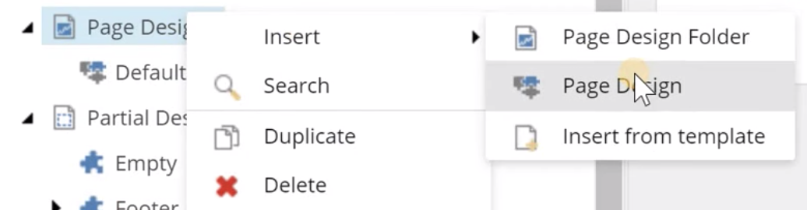
*SXA Experience Editor Page Design Insert menu*

Once you have named your new page, you will be presented with options for your new page. Under the *Designing* section, ALL shared *Partial Designs* are available to be selected for the page design. Clicking the name will move them over to the Selected area.

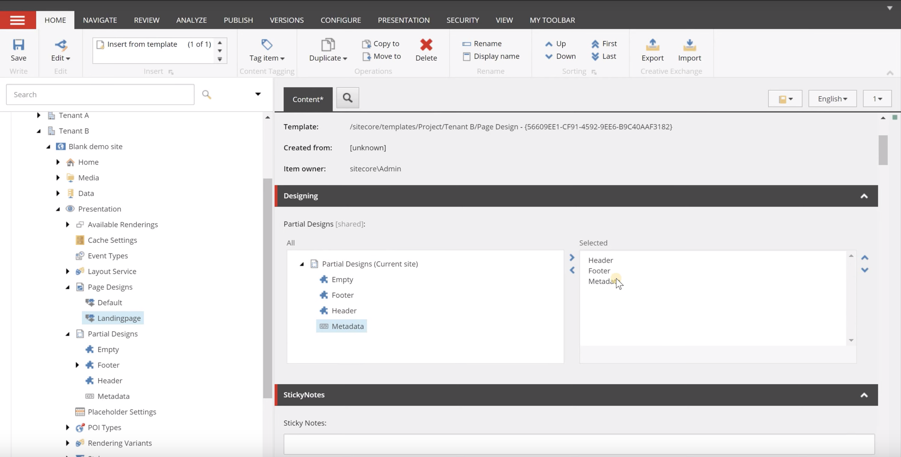
*SXA Experience Editor Page Design Window*

Add your *Header*, *Footer*, and *Metadata* *Partial Designs*, then click the save icon in the upper right-hand corner of the screen. Now, if you follow your website folder tree to; ```Tenant > *site_name* > Home > Page_#``` then right-click and select *Experience Editor*, you will be taken to the Experience Editor for that page.

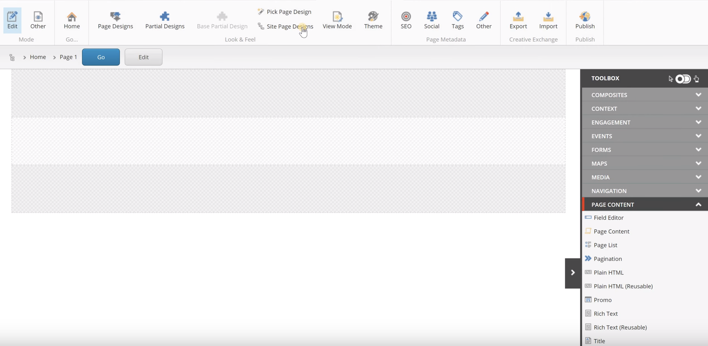
*SXA Experience Editor Page Design Setup. You can select a page design here*

Leave the *Home* Page alone, but set the *Page* design type to the *Page Design* you have previously created. Save the setting (upper right-hand corner), you should then see the header and footer automatically assigned to your page.
</details>
<details>
<summary>Rendering Variants - Part 1 - The Basics</summary>
<br />  

*What are Rendering Variants and when should you use them?*

In Sitecore, most of the pages that display content can be rendered using *Rendering Variants*. In your project folder tree, look at ```sitecore > Templates > Project > Tenant > Blog Post```. Here you can *Build* a template that can be used to structure your blog posts.

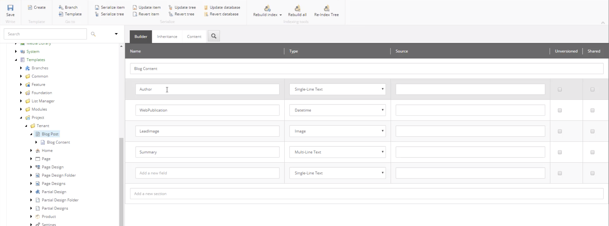
*SXA Experience Editor Rendering Variants Blog Post Template. Set up the fields needed for blog posts*

If you open a Blog Post in the sitecore *Experience Editor*, you can drop a *Page Content* component into the main section of the blog post (find this component in the *PAGE CONTENT* section of available components on the right-hand side of the *Experience Editor*). By default, the *Page Content* component will use the first found rendering variant. To make a new *Rendering Variant* definition, check the screenshot below.

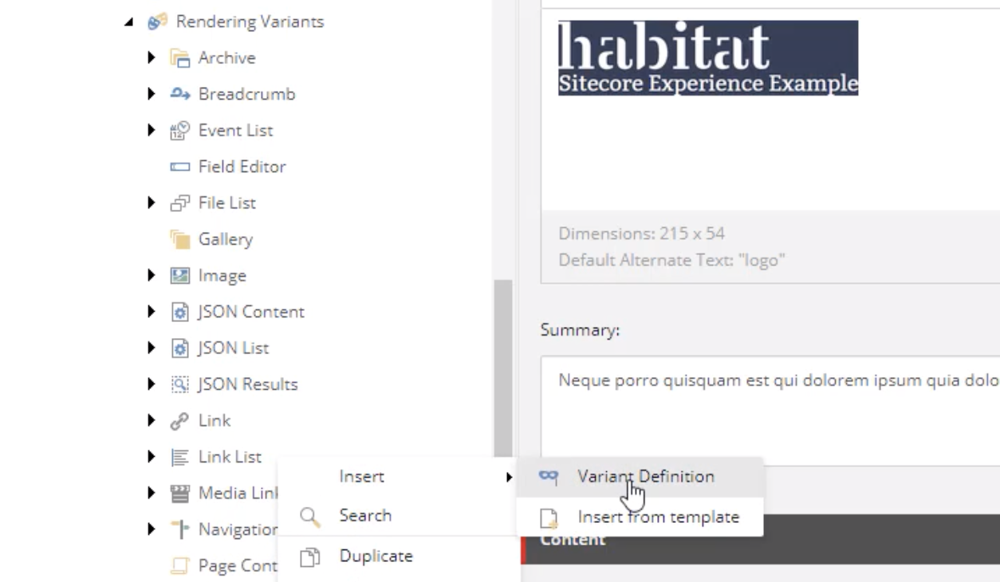
*SXA Experience Editor Rendering Variants Page Content Variant*

The *Variant Definition* wizard will launch and you can enter a new name for your variant definition. After you have named your rendering variant definition, it will appear under ```Page Content > *new_rendering_variant*```. You can now insert a variety of rendering variant renderers that will be available for your *new_rendering_variant*. Add a new *Field* and name it "Title" then set the *Tag* to h1. Make sure you click the *Save* button in the upper right-hand corner of the screen.

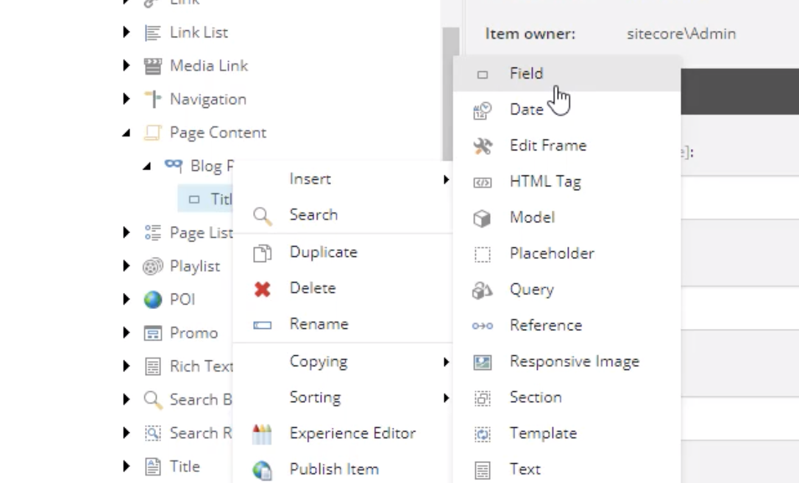
*SXA Experience Editor Rendering Variants Page Content Variant Add Field*

Now that you've added a field to your rendering variant, add another! This time add a field and name it *Author*. In the *Variant Details* section, set the *Tag* to a ```<span>```. In the *Data attributes* section of your new field, you can specify inline style attributes, but don't.

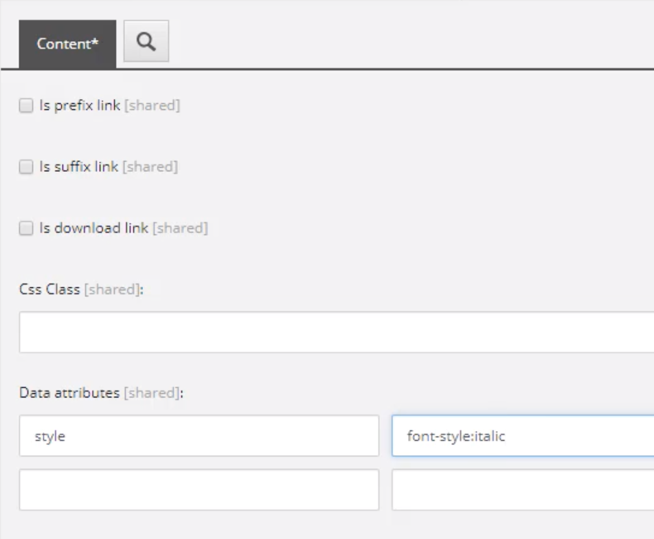
*SXA Experience Editor Rendering Variants Page Content Variant Add Field Data Attributes Inline Styling… Please DON'T*

Now, if you click the *Save* button (you should hopefully know where it is by now, but if not... it is in the upper right-hand corner), you can load up your *Blog Post* page and see that you now have an author field in your render variant. As you add additional content to your rendering variant, you can simply reorder the items by dragging and dropping them within the folder tree, otherwise, sitecore will order them in the order they were created.

Add a *Date* field to your rendering variant, name it however you like, play with the settings, i.e. format of date (hint: there is a dropdown within the *Date* rendering variant component settings), save it, reorder it from within your folder tree, then check the result on your *Blog Post* page. Try adding an ```<hr>``` by using the *HTML Tag* element type.

When exposing content that has been defined in a page type, make sure to set up fields in your rendering variant that match the different fields in your page. i.e. if you have an image and it is called *MyImage* make sure that the *Field Name* matches.

In order to provide some additional structure to all of these items that you are generating to build a rendering variant, adding *Section* elements to your rendering variant can help keep things organized. Just as you've added a *Field* or an *HTML Tag*, right-click on the rendering variant name and ```Insert > Section```. Name your sections semantically, i.e. *Header*, *Main*, *Footer*. Then, you can drag and drop your different elements into your sections. *Sections* can also be styled via *Data attributes*, but DON'T

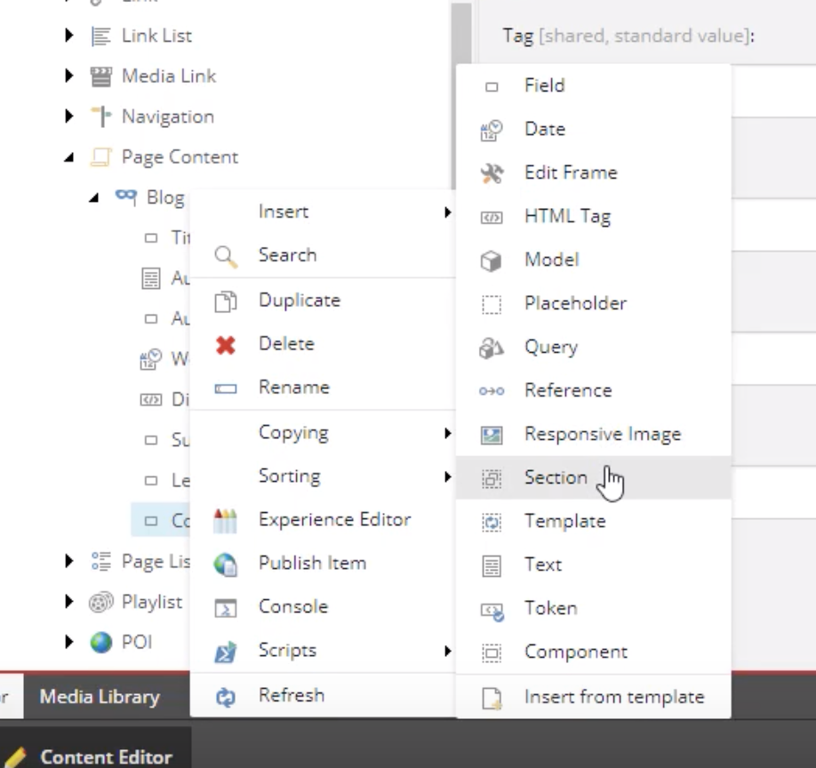
*SXA Experience Editor Rendering Variants Page Content Variant Add Sections. You can organize your render variant with sections*

Great, now you've manually built a rendering variant and applied it to a *Blog Post*, but you are missing the automation that sitecore and SXA brings. Let's make a *Partial Design* from all of this work.

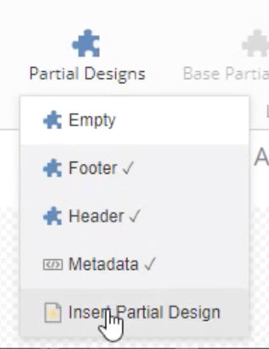
*SXA Experience Editor Rendering Variants Page Content Variant Insert Partial Design. Let's make a partial design out of our rendering variant*

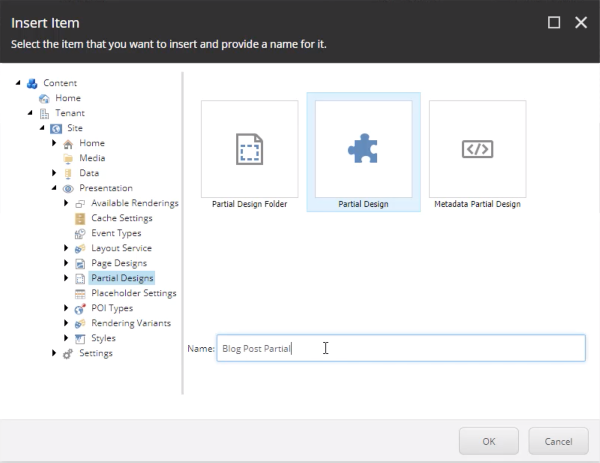
*SXA Experience Editor Rendering Variants Page Content Variant Insert Partial Design Wizard. Let's make a partial design out of our rendering variant*

Once you have created the partial design, drop the *Page Content* component into the *main* section of the page, then set the *Variant* to the variant you have previously been working with in this chapter. Save your thing. Then create a *Page Design* so that you can assign the just created *Partial Design* to the *Page Design*.

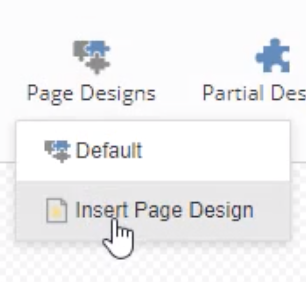
*SXA Experience Editor Rendering Variants Page Content Variant Insert Page Design.*

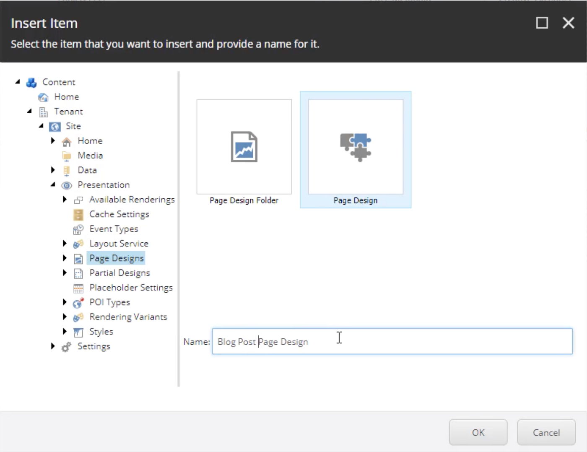
*SXA Experience Editor Rendering Variants Page Content Variant Insert Page Design Wizard*

After giving your *Page Design* a name, in the next dialogue wizard that appears, you will have to assign the *Partial Designs* to your *Page Design*. Save that, then you will be able to associate your new *Page Design* with whatever type page needed, in this case *Blog Post*. Do that in the *Site Page Designs* menu at the top-center of the screen.
</details>
<details>
<summary>Create Fixed Layouts with the Page Content Component</summary>
<br />  

*With the Page Content Component, you can speed up development by creating Fixed Layouts*

The recommended approach to using SXA is to give content authors freedom for Landing Pages, allow them to arrange components how they like. But for the more detailed pages, for example a blog page or a news article, it's better to create fixed layouts so that your visitors are not disoriented navigating through your site. This is where the *Page Content Component* comes in handy. It can read all of the different fields and values of your different pages and display them in a certain layout. Navigate to ```Templates > Project > *your_tenant* > Custom templates```. If you do not have the *Custom templates* folder, create one, otherwise, right-click on the *Custom templates* folder and ```Insert > New Template```, this will launch the *New Template* wizard. The *New Template* wizard will guide you through the *New Template* creation process. Give your new template a name.

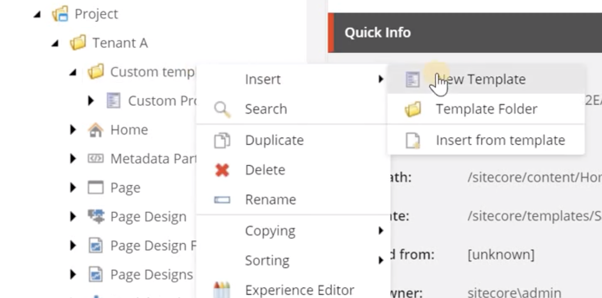
*SXA Experience Editor Create Fixed Layout Custom Template*

In the *New Template* wizard, after you have given it a name, select the *Base template*. The video example provides the following path ```Templates > Project > *new_tenant* > Page```. After you have selected the *Base template*, click *Next* to save your *New Template*. Locate your new template in your project folder tree, then select it by clicking on its name. On the right-hand side of the project folder tree, options related to your new template will open up.

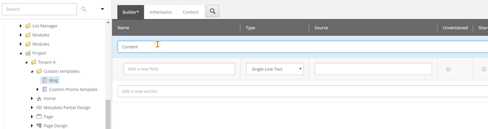
*SXA Experience Editor Create Fixed Layout Custom Template Options*

In the *Builder* tab for the new template, add a section named *Content* then define 2 additional fields below the new section name:

<table>
  <thead>
    <tr>
      <th>Name</th>
      <th>Type</th>
    </tr>
  </thead>
  <tbody>
    <tr>
      <td>Summary</td>
      <td>Multi-Line Text</td>
    </tr>
    <tr>
      <td>Publishdate</td>
      <td>Date</td>
    </tr>
  </tbody>
</table>

Now that you have your new fixed layout, go to ```sitecore > Content > *tenant_name* > *site_name* > Home``` and right-click on *Home*. You should be able to click *Insert* and see your new fixed layout that was just created as an option when creating a new page for your site. Select the new fixed layout type and give your page a name. If everything has been correctly set up, you should now see your new page with the fields that were established above.

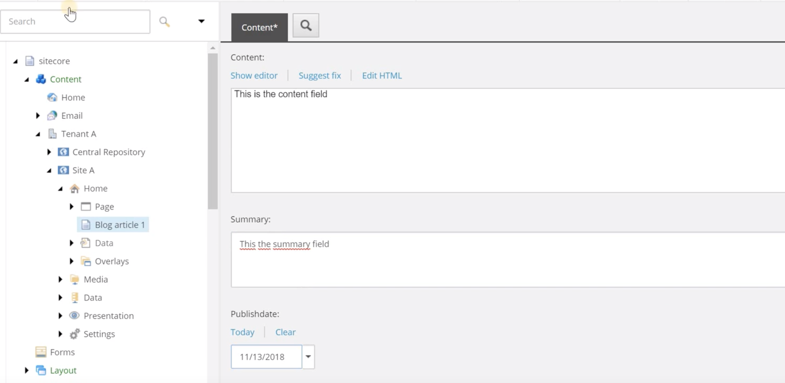
*SXA Experience Editor Create Fixed Layout Custom Template Applied*

Using your new template, you can create new pages that have the type of your template and each page will be generated according to how you defined the template. Finally a shoutout to FED, it is said that with the basic structure of our pages defined, we are free to style the page the way we need. Yay SXA ?!
</details>
<details>
<summary>Creating and Working with Styles</summary>
<br />  

*Styles can be used by both your Frontend Developers and your end users, Content Authors or Marketers*

Following the path ```sitecore > Content > *tenant_name* > *site_name* > Presentation > Styles``` you can configure your own styles. Inside of the path, you will find many directories related to the various components in sitecore. See the following photo for more information.

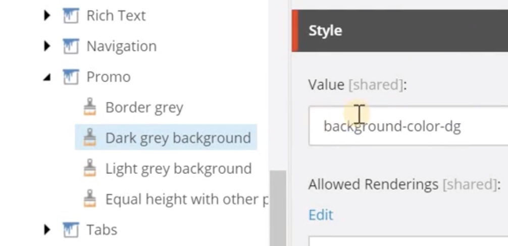
*SXA Experience Editor Creating and Working with Styles, an Individual Style Definition*

Within the *Style Definition*, whatever is typed in the *Value* field will be the class name (see above *Value* background-color-dg). This *Style Definition* will now be available to apply to components when you are working on a page in the *Experience Editor*. Simply click the component you would like to apply the style to, when the component editor window appears, click *More* then *Edit component properties*

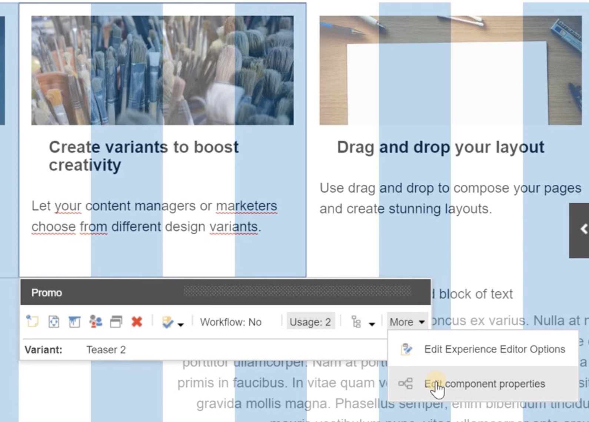
*SXA Experience Editor Creating and Working with Styles, Styling a Component*

From the above, you will be brought to a *Control Properties* wizard for the component you are working with. If you scroll down, you will find all of the style definitions that are available to the particular component you are working with.

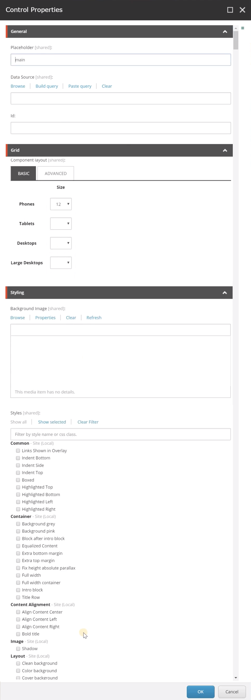
*SXA Experience Editor Creating and Working with Styles, Component Control Properties Wizard*
</details>
<details>
<summary>The SXA Themes - Structure and Inheritence</summary>
<br />  

*The overall look and feel of a website is because of a theme.*

sitecore / SXA comes with a two base themes; Wireframes & Wireframes (deprecated). There is also a set of *Base Themes* that style components. When you create a Tenant and then a site, you will also get a corresponding Tenant / site set of folders in the *Themes* folder. This is where you place your site theme. Back up the folder tree, in ```sitecore > Content > *tenant_name* > *site_name*```, if you click on the site_name, you can export the site to hand off to a FED team to implement the styling. Check the screenshots below.

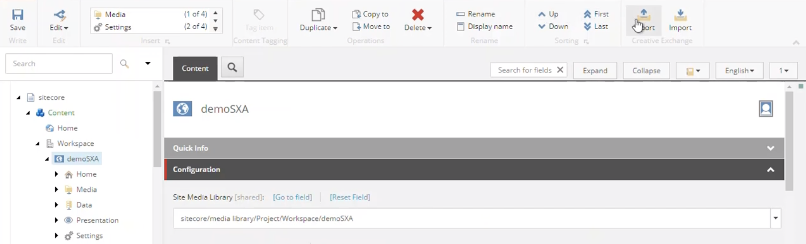
*SXA Experience Editor Theming, Export Site Theme*

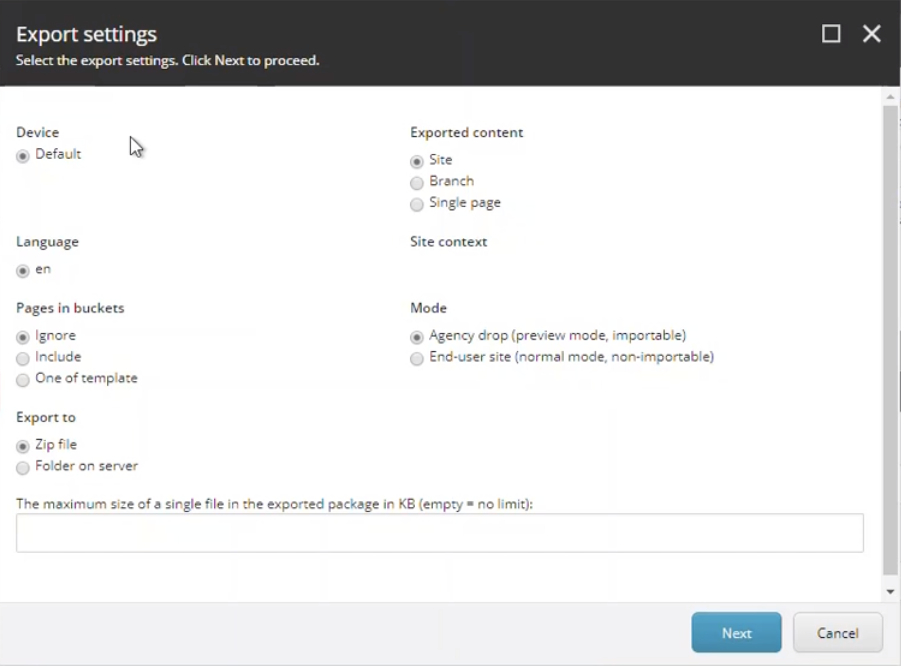
*SXA Experience Editor Theming, Export Site Theme Wizard. Here you can select different options for exporting your site theme*

In the export site theme wizard shown above, there are a variety of settings that you may need to change when exporting your site theme.

* Device - If there is more than one device-based theme available for your site, more options would appear
* Language - If there are additional languages activated for your site instance, more options would appear
* Pages in buckets - Not very clear what this does, but you can select Ignore, Include, or One of template
* Export to - .zip file or server location? Should be pretty self explanatory
* Exported content - entire Site? a Branch? or a Single page? Your needs should dictate the choice you make here
* Mode - Either you can re-import the site later on by making it importable, or not...

Once you have made the difficult choices with the export site theme wizard, click the button labeled *Next*. Your site will export, there is even a delightful animation to keep you distracted while the wizard works his magic.

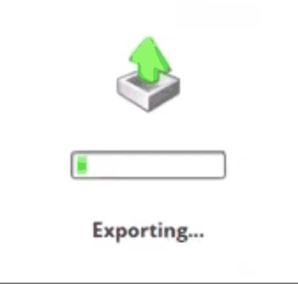
*SXA Experience Editor Theming, Export Site Theme Exporting Animation for your enjoyment*

After the wizard is done, you can download your .zip file. *If you chose that option in the intial setup* Abruptly moving on, let's talk about *gulp* files. The *gulp* is a task runner. Read more about [*gulp*](https://gulpjs.com/). In sitecore, and any project that uses *gulp*, once configured, there are various tasks that do things.

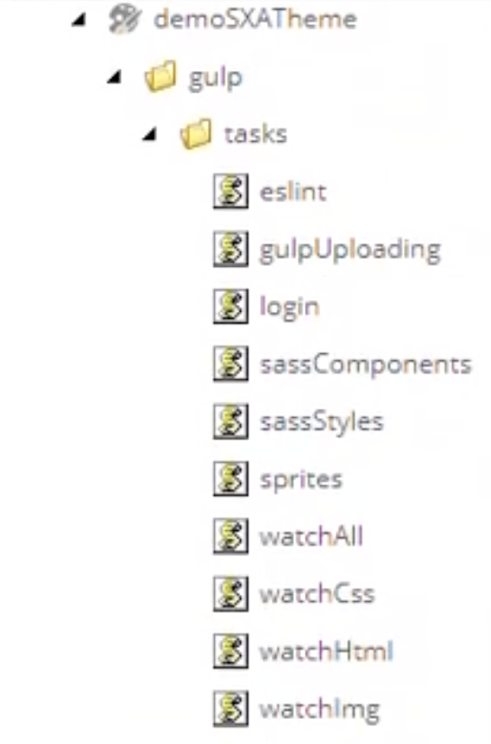
*SXA Experience Editor Theming, Export Site Theme Gulp task list*

In the *sass* folder, there are *sass* files. In passing, we know that the *sass* will be handled by the *gulp*. In the *fonts* folder, there are fonts. In the *images* folder, there are images. And in the *styles* folder, there are styles.

Imagine for a moment that your client would like a theme just for Christmas. Don't overwrite your style files! Make a new site theme! Right-click on your site name in the folder tree, then follow ```Scripts > New Site Theme```. The *New Site Theme* script will run and eventually open the *Create a new SXA site theme.* wizard. Tell the wizard all of the things.

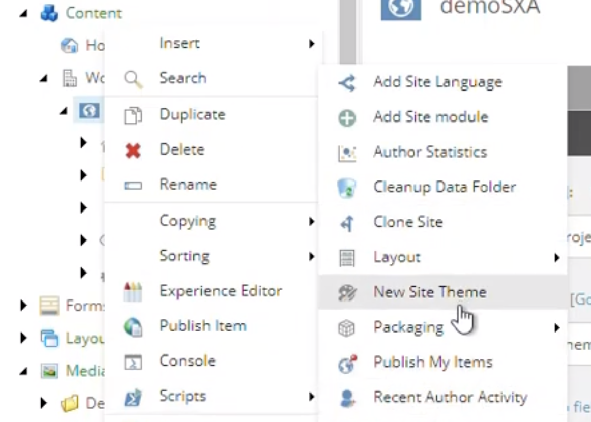
*SXA Experience Editor Theming, New Site Theme*

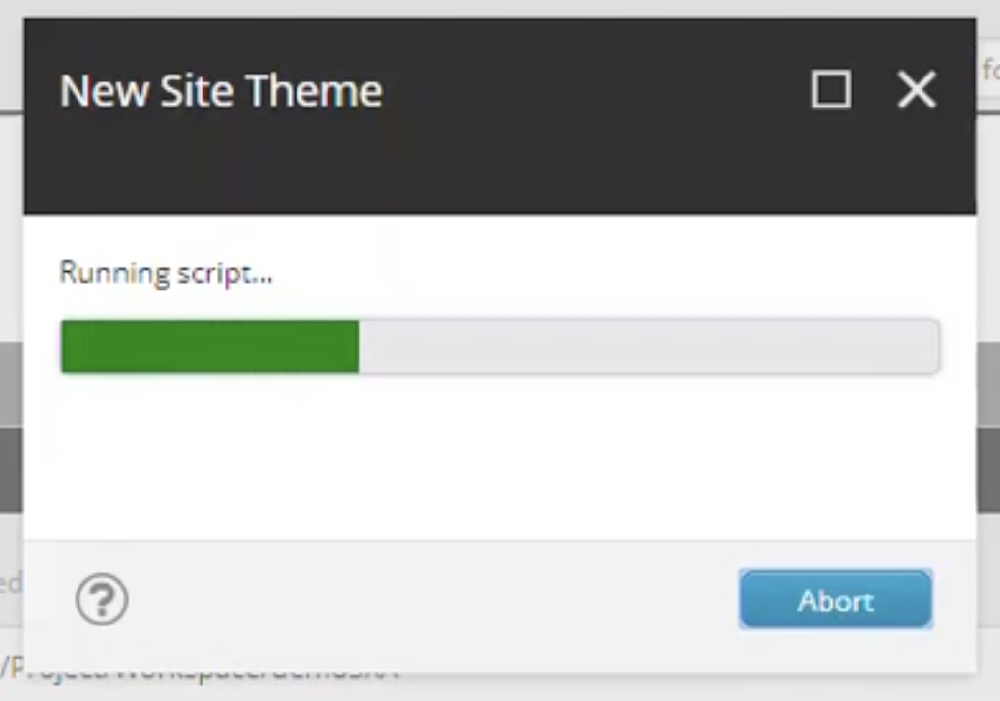
*SXA Experience Editor Theming, New Site Theme Script Running*

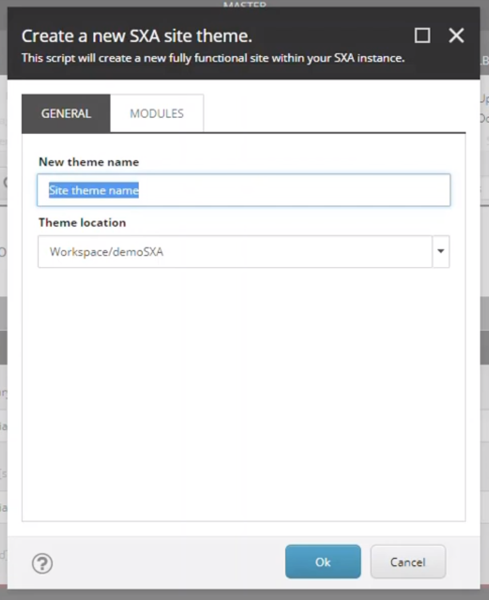
*SXA Experience Editor Theming, New Site Theme Wizard*

After naming your new theme, you can just click next. The *New Site Theme* script will then finish up. The amount of time that the *New Site Theme* script takes to run is directly correlated to the processing power of your computer. Once hell has frozen over, your new theme will be somewhere... maybe ```... > Themes > *tenant_name* > *site_name*```. Now that you have your new theme, you can make all the required changes and the changes will only affect that theme! And 3 minutes of clicking around later... You can make all the required changes and the changes will only affect that theme! Seriously, there was nothing useful stated at the end of the video.
</details>
<details>
<summary>Introduction to Responsive Grid Settings for Components</summary>
<br />  

Jumping right in... in the *Experience Editor* turn on the *Grid*, it is under the *VIEW* tab at the top of the *Experience Editor*. Then, back in the canvas section of the *Experience Editor*, you will see the grid when you click on a section of the page i.e. header, main, footer.

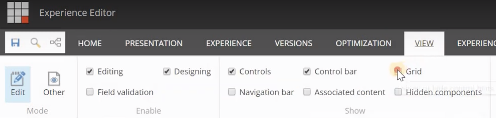
*SXA Experience Editor Responsive Grid, turn it on*

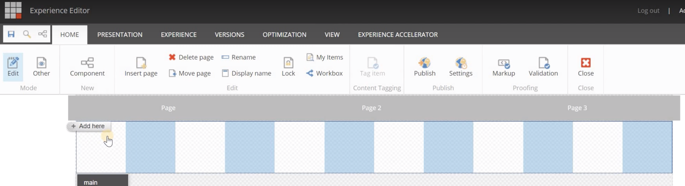
*SXA Experience Editor Responsive Grid, this is how it looks when you are working on the component canvas with the grid turned on*

The columns shown above are the grid. There are likely to always be 12 columns. These columns are used to lay out components and content. You will need to tell the components how much space they are allowed to take, i.e. how many columns wide they can be. Add a *Rich Text* component to the main area of your canvas. Add some lorem ipsum placeholder text to your *Rich Text* component. Hit save in the upper right-hand corner of the *Experience Editor*. If you do not hit save and start making adjustments to the grid settings for your component, it is possible that your changes will be lost and no one wants that, except for the *Experience Editor*... Anyway, it is always good practice to save. With your component selected, click *More* on the component editor panel, then *Edit component properties* to bring up the component properties dialogue window.

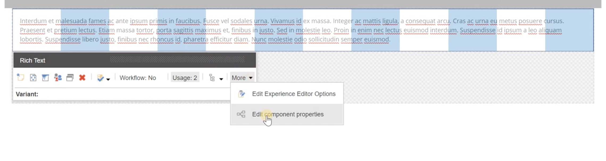
*SXA Experience Editor Responsive Grid, edit the component*

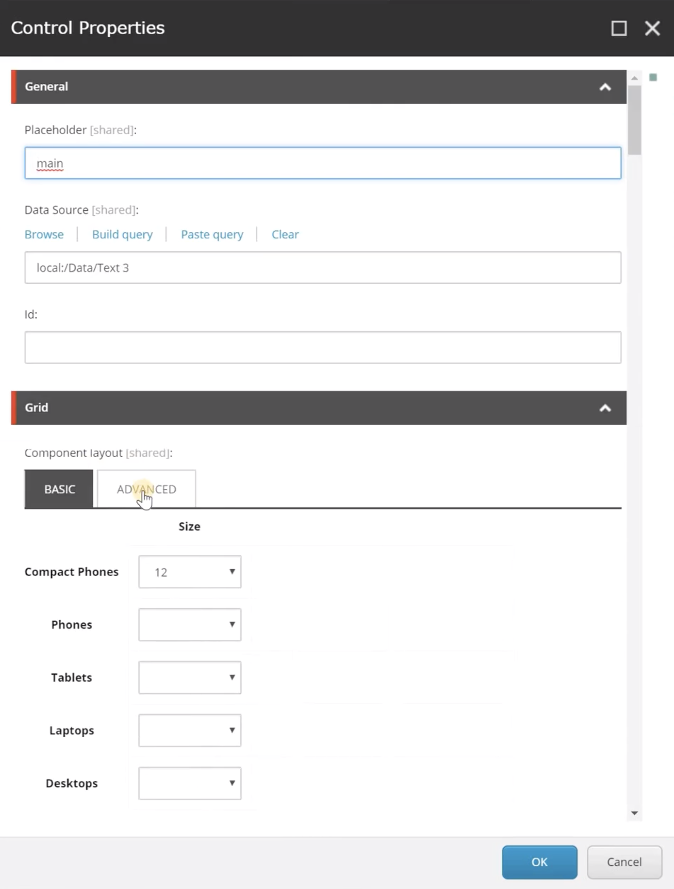
*SXA Experience Editor Responsive Grid, edit the component with this dialogue window. See the grid settings?*

The component grid settings are organized by a mobile first approach, from smallest device type to largest. In the above screenshot, *Compact Phones* is set to 12, which means that this component will take up all of the available column space and since no other devices types have settings applies, they will inherit from the *Compact Phones* setting. If you would like to modify the components column settings for other device types, simply click on the dropdown menu next to the device name and set the number of columns you would like the component to use accordingly. If you skip a device type, the setting from a higher level device type will be inherited until the next definition is reached. i.e. if the *Compact Phones* and *Tablets* have settings, but no other devices are set, then *Phones* will inherit its settings from *Compact Phones* and *Laptops* & *Desktops* will inherit their settings from *Tablets*. yay. Set the *Tablets* column settings to 6. Save.

Add another *Rich Text* component as above and repeat the steps to make it take up 6 columns. Now you should have something that looks like this:

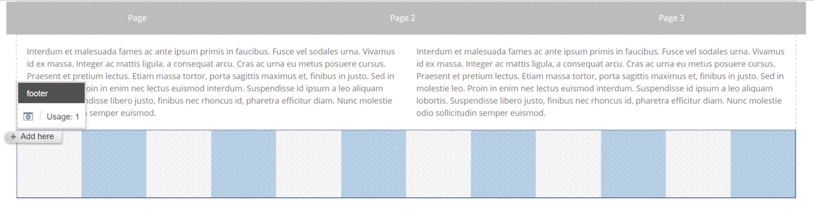
*SXA Experience Editor Responsive Grid, these two Rich Text components have their columns set to 6 for devices Tablets and up*

If you would like to confirm that the column settings you have made are in fact working, open up the Chrome inspector and toggle the responsive view mode or resize your browser window and watch the magic unfold.

The most important thing is to remember that you have 12 columns to work with.
</details>
<details>
<summary>Configuring and Working with Shared Sites</summary>
<br />  

*Working with shared sites, how to configure them, and what you can do with them*

Imagine a real-life company (this is what a *tenant* is in sitecore) with multiple brand sites (these would be the sites that live under the company *tenant*) that have some shared content (about us, contact, something else?), wouldn't it be nice to be able to manage this shared content in a central place and not have duplicate content? The suggested approach here would be to literally create a site instance that serves as a central repository, then in however many site instances you have to create, you can use the central repository assets, components, etc for your other sites. If you click on your tenant folder, the right-hand side of your screen will show the *Content* viewer for your tenant. If you scroll down the *Content* view, you will hit a *Sharing* section where you can configure sites that are Shared or not. In the following screenshot, *Central Repository* has been added to the *Shared sites*. Other sites will now be able to use content that exists on the *Central Repository*.

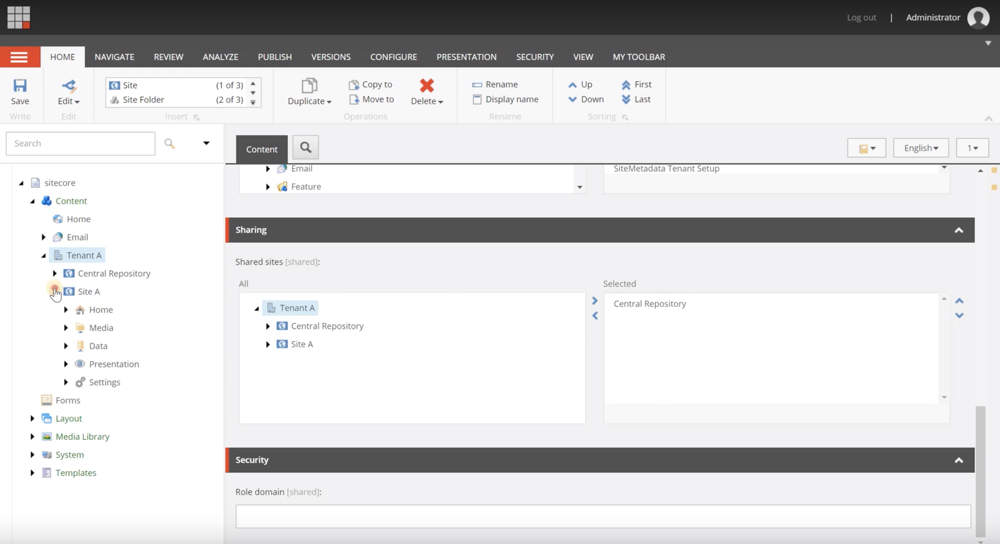
*SXA Experience Editor Shared Sites, see the Central Repository added to the shared sites*

Now that a shared site has been set for the tenant, when adding components in the *Experience Editor*, you will be able to *Select the Associated Content* and will see the shared site that wasjust set up as an option for the associated content.

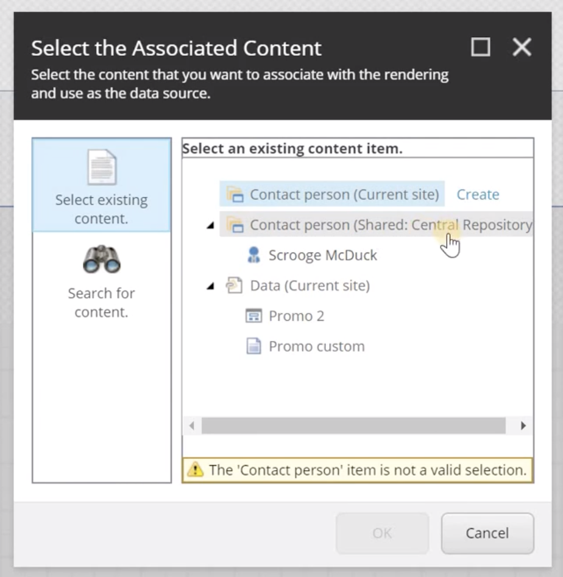
*SXA Experience Editor Shared Sites, set up the associated content for the component*

Another thing you can do with shared sites is work with rendering variants. In the following screenshot, you can see that the *Contact* component in the *Experience Editor* has 2 available variants which come from the central repository that was established earlier.

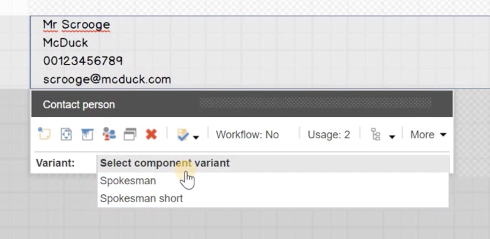
*SXA Experience Editor Shared Sites, this component has 2 rendering variants available from the central repository*

Another aspect of shared sites is that their *Page Designs* and *Partial Designs* are available to be used by other sites. Styles are also available from shared sites. As seen previously, when a component is selected in the *Experience Editor*, click on *More*, then *Edit component properties*. In here you can add classes that come from the central repository.
</details>
</details>
<br />
<details>
<summary>SXA Rendering Variants</summary>
<details>
<summary>Part 1 - The Basics</summary>
<br />  

Link to YouTube video for this section [SXA Rendering Variants Part 1 - The Basics](https://youtu.be/HyMCJ0zhbK8)

*What are Rendering Variants and when should you use them?*

In Sitecore, most of the pages that display content can be rendered using *Rendering Variants*. In your project folder tree, look at ```sitecore > Templates > Project > Tenant > Blog Post```. Here you can *Build* a template that can be used to structure your blog posts.


*SXA Experience Editor Rendering Variants Blog Post Template. Set up the fields needed for blog posts*

If you open a Blog Post in the sitecore *Experience Editor*, you can drop a *Page Content* component into the main section of the blog post (find this component in the *PAGE CONTENT* section of available components on the right-hand side of the *Experience Editor*). By default, the *Page Content* component will use the first found rendering variant. To make a new *Rendering Variant* definition, check the screenshot below.


*SXA Experience Editor Rendering Variants Page Content Variant*

The *Variant Definition* wizard will launch and you can enter a new name for your variant definition. After you have named your rendering variant definition, it will appear under ```Page Content > *new_rendering_variant*```. You can now insert a variety of rendering variant renderers that will be available for your *new_rendering_variant*. Add a new *Field* and name it "Title" then set the *Tag* to h1. Make sure you click the *Save* button in the upper right-hand corner of the screen.


*SXA Experience Editor Rendering Variants Page Content Variant Add Field*

Now that you've added a field to your rendering variant, add another! This time add a field and name it *Author*. In the *Variant Details* section, set the *Tag* to a ```<span>```. In the *Data attributes* section of your new field, you can specify inline style attributes, but don't.


*SXA Experience Editor Rendering Variants Page Content Variant Add Field Data Attributes Inline Styling… Please DON'T*

Now, if you click the *Save* button (you should hopefully know where it is by now, but if not... it is in the upper right-hand corner), you can load up your *Blog Post* page and see that you now have an author field in your render variant. As you add additional content to your rendering variant, you can simply reorder the items by dragging and dropping them within the folder tree, otherwise, sitecore will order them in the order they were created.

Add a *Date* field to your rendering variant, name it however you like, play with the settings, i.e. format of date (hint: there is a dropdown within the *Date* rendering variant component settings), save it, reorder it from within your folder tree, then check the result on your *Blog Post* page. Try adding an ```<hr>``` by using the *HTML Tag* element type.

When exposing content that has been defined in a page type, make sure to set up fields in your rendering variant that match the different fields in your page. i.e. if you have an image and it is called *MyImage* make sure that the *Field Name* matches.

In order to provide some additional structure to all of these items that you are generating to build a rendering variant, adding *Section* elements to your rendering variant can help keep things organized. Just as you've added a *Field* or an *HTML Tag*, right-click on the rendering variant name and ```Insert > Section```. Name your sections semantically, i.e. *Header*, *Main*, *Footer*. Then, you can drag and drop your different elements into your sections. *Sections* can also be styled via *Data attributes*, but DON'T


*SXA Experience Editor Rendering Variants Page Content Variant Add Sections. You can organize your render variant with sections*

Great, now you've manually built a rendering variant and applied it to a *Blog Post*, but you are missing the automation that sitecore and SXA brings. Let's make a *Partial Design* from all of this work.


*SXA Experience Editor Rendering Variants Page Content Variant Insert Partial Design. Let's make a partial design out of our rendering variant*


*SXA Experience Editor Rendering Variants Page Content Variant Insert Partial Design Wizard. Let's make a partial design out of our rendering variant*

Once you have created the partial design, drop the *Page Content* component into the *main* section of the page, then set the *Variant* to the variant you have previously been working with in this chapter. Save your thing. Then create a *Page Design* so that you can assign the just created *Partial Design* to the *Page Design*.


*SXA Experience Editor Rendering Variants Page Content Variant Insert Page Design.*


*SXA Experience Editor Rendering Variants Page Content Variant Insert Page Design Wizard*

After giving your *Page Design* a name, in the next dialogue wizard that appears, you will have to assign the *Partial Designs* to your *Page Design*. Save that, then you will be able to associate your new *Page Design* with whatever type page needed, in this case *Blog Post*. Do that in the *Site Page Designs* menu at the top-center of the screen.
</details>
<details>
<summary>Part 2 - Working with References and Links</summary>
<br />  

Link to YouTube video for this section [SXA Rendering Variants Part 2 - Working with References and Links](https://youtu.be/rrz-dKYjHp0)

Following up on the previous *Rendering Variants* *Blog Post* has been extended. The Author / Single-Line Text has been subbed for Authors / Multiroot Treelist with a dynamic source.

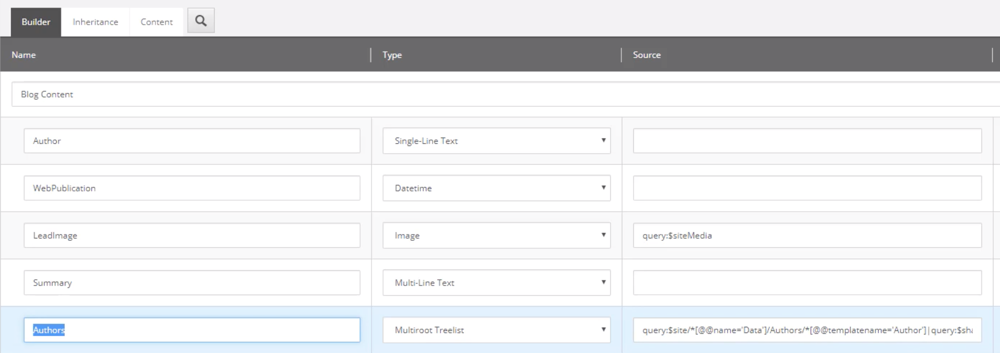
*SXA Rendering Variants Working with References and Links Dynamic Source Example*

To set up the dynamic source for the *Blog Post*, a new folder has been added ```sitecore > Content > *tenant_name* > *site_name* > Data > *new_folder_name*```, in this case the new folder is called *Authors* and a bunch of authors have been added. A new rendering variant is required for this new set of *Data*. To create a new *Rendering Variant* follow this path ```sitecore > Content > *tenant_name* > *site_name* > Presentation > Rendering Variants > Page Content```, right-click on *Page Content* then ```Insert > Variant Definition```. Give your new *Variant Definition* a name.

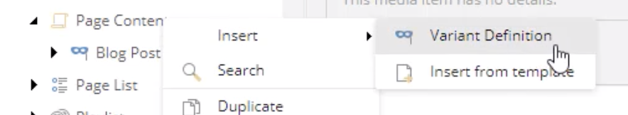
*SXA Rendering Variants Working with References and Links, creating a new variant definition for Page Content component*

If you click on your new variant definition, the *Content* window to the right of the folder tree will become active for the new variant definition. Scrolling down the *Content* window, there is a field to add CSS classes to the variant definition, add any classes as needed, separated by a space. Right-click on the name of the new rendering variant and ```Insert > Reference``` to create a reference to a data source. In the video, that name is *Authors*. With the reference set up, the rendering variant can now access the fields from that which it referenced *Authors*. The next step is to add a wrapper around the reference, so right-click on the variant definition and ```Insert > Section```. Name the wrapper as needed, in this case *Header Wrapper*. Manually move the new wrapper under the new reference. Right-click on the new *Header Wrapper* and ```Insert > Field```. Since this variant definition has a reference to another set of *Data*, the fields from within the original source are available. To access the fields from the *Data* source, new fields in the rendering variant should match the names of the fields from the original reference, i.e. if there is a field named 'First Name' in the original *Data* source, then the reference should use the same field name 'First Name' in order to access that data. At this point, if you have references set up correctly, you should be able to test out the rendering variant from within the *Experience Editor* by simply dropping the appropriate component into the *main* section of your page, then selecting the *Variant* that you have been working on. If everything was setup correctly, your rendering variant will display the appropriate content and styling according to how it was set up.

If there are additional fields available from the data source, i.e. an image or additional text or date, continue to add them to the reference, make sure to save the changes, then refresh the page where you are testing the component. Rendering Variants will render as many times as needed per page, as in the instance of this tutorial, if there are 2 or more authors on a *Blog Post*, the rendering variant will apply to each instance of an author. Add the variant to the *Partial Designs* for the page you are working on and it will be used to populate the page as it is set up outside of the *Experience Editor*.
</details>
<details>
<summary>Part 3 - Querying Content</summary>
<br />  

Link to YouTube video for this section [SXA Rendering Variants Part 3 - Querying Content](https://youtu.be/BsamkDxp_dI)

*Querying Content in Rendering Variants*

We've covered passing through links to get content from content items that are linked to the items that are being rendered. But not all links are rendered this way. Sometimes there needs to be field comparison to get some related content to the render. That is what we will be learning here. To build this out, there has been an additional field added to *Page* ```... > Templates > Project > Tenant > Page```. The field is named *RelatedProducts* of type *Treelist* with a dynamic source, in this case *query:$home/Products*.

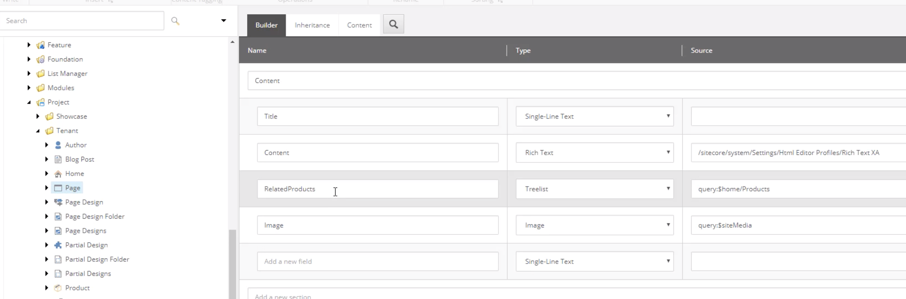
*SXA Rendering Variants Querying Content, dynamic query field with name, type, and source highlighted*

The next step is to create a rendering variant, again using the *Page Content* component. Finally, the presenter admits that you should not continue adding items under this component type, but that you should in fact clone it to use for your rendering variant needs. But of course that's not what we are gonna do in this video! Simply ```Insert > Variant Definition```, name the thing (in this case *Related Products*), then in the *Related Products* variant definition, right-click on its name then ```Insert > Text``` and name it *Title*. Change the *Tag* to an ```h3``` and add some *Text* (Related Products?).

The variant definition is able to render out and iterate through content that has been defined within pages and posts. In the *Related Products* rendering variant, right-click then ```Insert > Reference``` and name it the same as the field that you would like to target i.e. *RelatedProducts* (this is the field that has been defined in the video). The presenter is always shuffling around the sub-components as they are added, is this presentation related, or is there another purpose?

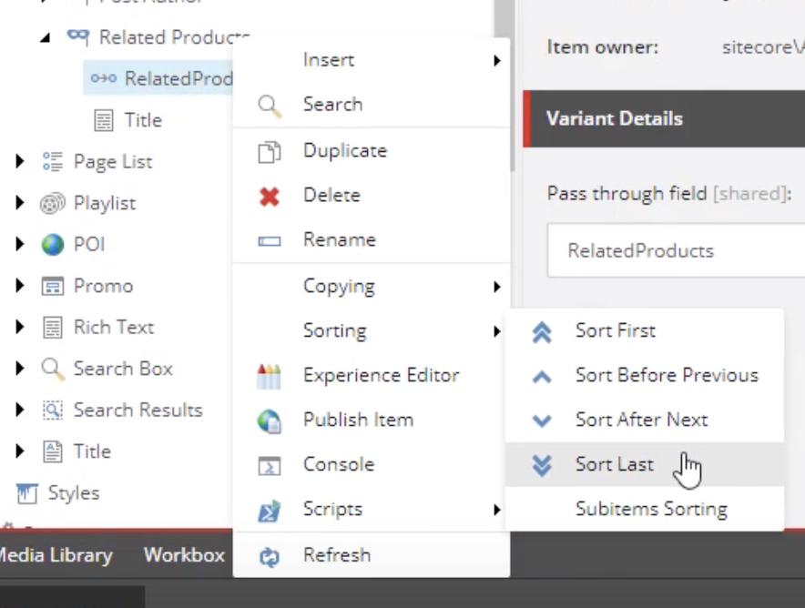
*SXA Rendering Variants Querying Content, sort your sub-components, because the presenter did!*

Of course, don't forget to add inline styling to your rendering variants, becuase that's what you should do. Now that you have thte variant definition set up, you can add additional fields (according to those that exist in the definition that you are referencing), i.e. render a field and reference it's name to target it. In the *Variant Details* section of your new field, set a *Tag* type if needed (the *Tag* refers to HTML i.e. h4). You can also ```Insert > HTML Tag``` if you need, for example, a horizontal rule.

Now comes the fun part, and the purpose of this chapter on rendering variants, adding a query. Right-click on the reference within the *Rendering Variant* and ```Insert > Query```. In the *Variant Details* section of ttthe *Query*, build your query ```query:./*``` < selects immediate children, then right-click on the new *Query* and ```Insert > Field``` and name it according to a field that exists in the item you are referencing, in this case, *Title*. What we have looks like the following:

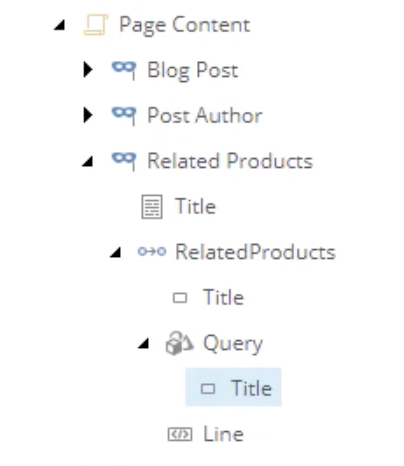
*SXA Rendering Variants Querying Content, this how the rendering variant for a query is structured in the project folder tree*

If you do the query right, you will get the right results. And... the above query does not get the intended results. It grabs all children when it should be more discriminate. Let's update that query to ```query:./*[@@templatename!='Page Data']```. That query can be found within sitecore, so if you don't remember the syntax or the precise query, simply searching for children at the top of the folder tree will reveal all items that refer to children and in those results you can find at least one item that has the aforementioned query already built. If you need more complex queries, you are SOL. But that query will get the children and leave out the *Page Data*, which is something that you may not need.

The remaining half of the video (from ~13:00) repeats the above steps, but builds another query based on *Taggable* content using a *token*. The entirety of this process is outlined in the link below.

Here is a link to the sitecore documentation about [Using a Query to Render Items](https://doc.sitecore.com/developers/sxa/18/sitecore-experience-accelerator/en/walkthrough--using-a-query-to-render-items.html)
</details>
<details>
<summary>Part 4 - Placeholders and Placeholder Restrictions</summary>
<br />  

Link to YouTube video for this section [SXA Rendering Variants Part 4 - Placeholders and Placeholder Restrictions](https://youtu.be/deeYre6u9_E)

*Let's talk about placeholders*

Speaking of *Rendering Variants*, here's some information about how to add a *Placeholder* for your content authors. Find one of your *Rendering Variants* and ```Insert > Placeholder```. This will insert a *Placeholder* into your rendering variant. Now your rendering variant will have a placeholder in it. Once in the *Experience Editor*, the *Placeholder* will allow you to drop additional components into your rendering variant.

Continuing on, we are presented with the idea of a blog and the presenter would like to add any tags associated with each post to appear under the title of the post and have it render in a list. Adding a *Placeholder* to the rendering variant allows you to drop in a taxonomy component that will render the tags, but the default way sitecore treats this placeholder will cause the tags to be rendered from the first list item then applied to all of the other posts in the render. To get the unique tags for each of the different posts, the *Placeholder* needs to have an additional setting applied, *Switch component context to currently rendered item*.

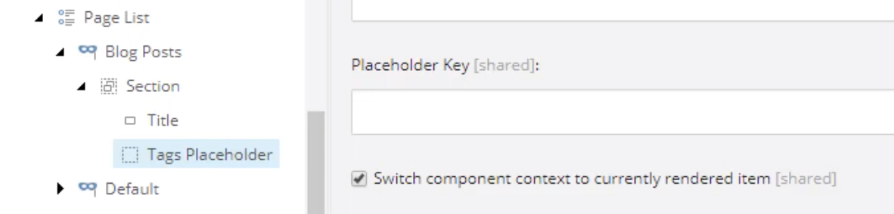
*SXA Rendering Variants Placeholders and Restrictions, get unique elements rendered in your placeholders by checking this box*

Above the checkbox you will notice a *Placeholder Key*. It is important to define a name for this key so that it can be targeted when defining a placeholder restriction. Give the *Placeholder Key* a name.   *Placeholder Settings* ```sitecore > *tenant_name* > *site_name* > Presentation > Placeholder Settings``` is home to the placeholder settings. To define a placeholder restriction, right-click *Placeholder Settings* then ```Insert > Placeholder```. Give your new placeholder a name (you may need to give it a name with a wildcard * to capture all instances of the placeholder you are targeting i.e. blog*). In the content window of the new placeholder, under *Allowed Controls* you can set what components are allowed for the placeholder. After defining what components are allowed for the placeholder, check in the *Experience Editor* and you will find components that are not allowed are unable to be placed within the placeholder.

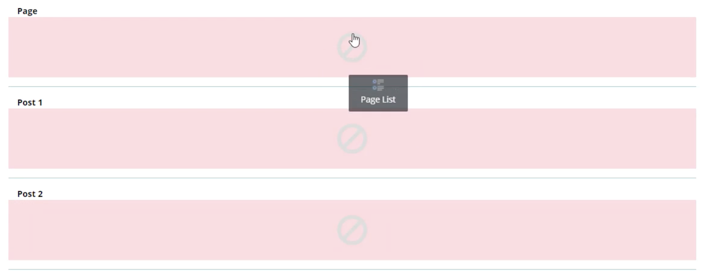
*SXA Rendering Variants Placeholders and Restrictions, good luck getting a restricted component into that placeholder*

That's great, but let's define some more restrictions. Within the Blog Posts Tag Placeholder definition, we should add a *Rules* to only render the related tags for posts with tags.

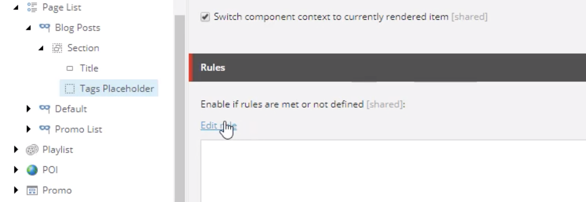
*SXA Rendering Variants Placeholders and Restrictions, to conditionally render something, add a rule*

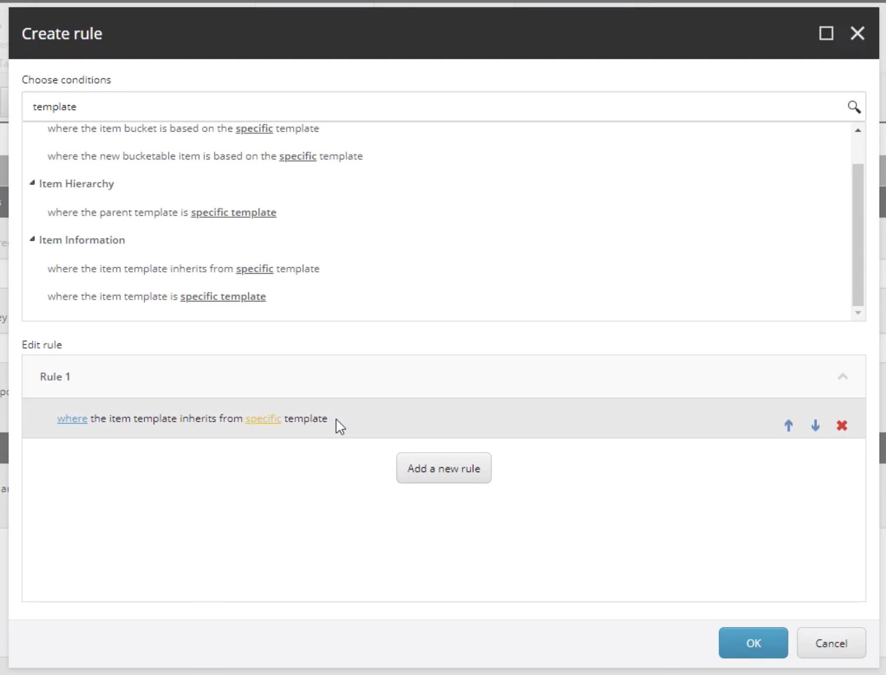
*SXA Rendering Variants Placeholders and Restrictions, here is the rule definition wizard*

Here is a link to the sitecore documentation about how to [Set Placeholder Restrictions](https://doc.sitecore.com/developers/sxa/17/sitecore-experience-accelerator/en/set-placeholder-restrictions.html)  

And here is another link from a sitecore MVP about the [multiple ways of using SXA placeholder settings](https://www.linkedin.com/pulse/sitecore-tip-22-multiple-ways-using-sxa-placeholder-emmerzaal/)
</details>
<details>
<summary>Part 5 - Edit Frames</summary>
<br />  

Link to YouTube video for this section [SXA Rendering Variants Part 5 - Edit Frames](https://youtu.be/x1YREa4KG3Y)

*Using Edit Frames to solve some problems with Rendering Variants*

In a rendering variant, when a reference is established, the variant will iterate through available items in a data source and render them according to the definition. This is normal, but if a content author would like to edit these items in any way, additional measures must be taken to set up this functionality. This can be done by wrapping references in an *Edit Frame*. Right-click on the top-level of the variant and ```Insert > Edit Frame```. You will need to move all of the rendering elements into the *Edit Frame* to make them editable.

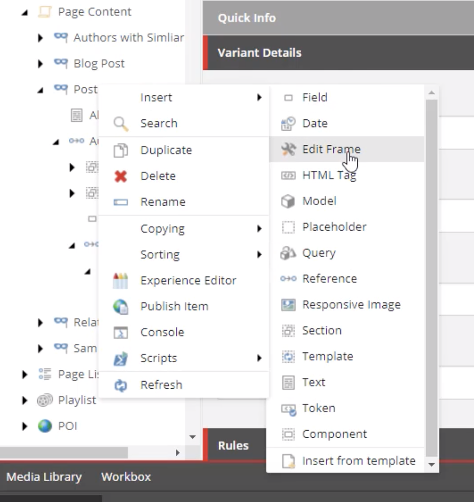
*SXA Rendering Variants Edit Frames, add an Edit Frame to a rendering variant*

The *Edit Frame* needs buttons to be selected. But the needed buttons are not available in the dropdown of available elements, but they do exist in the core database of sitecore ```/sitecore/content/Applications/WebEdit/Edit Frame Buttons```. Find the location of the buttons that you would like to use and, as you should have been doing in many other occasions, make a copy of the buttons, title them according to the element that they will belong to, and update the settings of the button; Header, Icon, Fields

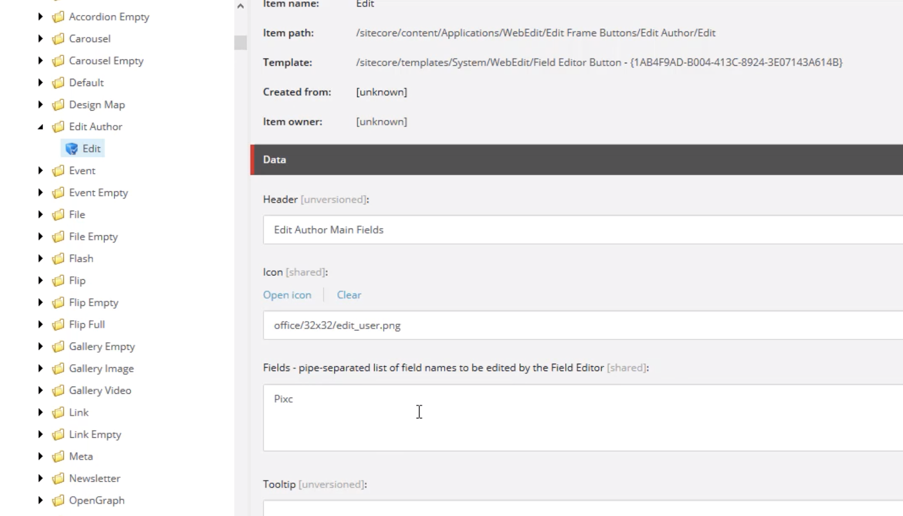
*SXA Rendering Variants Edit Frames, set up the buttons for your Edit Frame*

Back in the rendering variant, the buttons that were just defined are now available from the buttons dropdown for the *Edit Frame*. Click *Save* and return to the *Experience Editor* to see the *Edit Frame* just defined is now active and able to be used. *Edit Frames* can do more than buttons, but that is outside the scope of this video.

Further details about *Edit Frames* can be found in sitecores [Create a Rendering Variant](https://doc.sitecore.com/developers/sxa/18/sitecore-experience-accelerator/en/create-a-rendering-variant.html) documentation.
</details>
<details>
<summary>Part 6 - Responsive Images</summary>
<br />  

Link to YouTube video for this section [SXA Rendering Variants Part 6 - Responsive Images](https://youtu.be/22IXpZtG1u8)

*SXA can render through a simnple image rendering field by providing the field of type that is image*

Out of the box, the image rendering in sitecore does not provide responsive image field rendering, but it can be set up! Within rendering variants, there is an *Image* type. If you right-click on *Image*, you can set up a *Responsive Image* rendering variant!

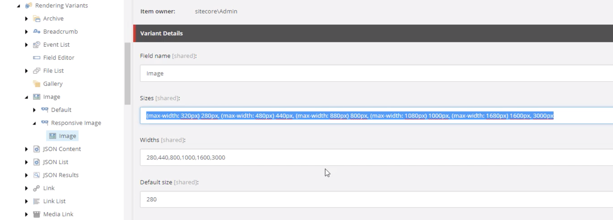
*SXA Rendering Variants Responsive Images, this is what it looks like to set up a responsive image rendering variant in sitecore*

The settings in *Sizes* will be determined by UX / FED. Under the hood, sitecore is generating the correct syntax to markup the page to render images responsively. [Check out this link for more information about responsive images](https://alistapart.com/article/using-responsive-images-now). Sitecore will only download the image according to the breakpoint as defined by the source set of images.

Here is sitecores documentation about how to [Render Image Fields Using the Responsive Image Variant](https://doc.sitecore.com/developers/sxa/17/sitecore-experience-accelerator/en/render-image-fields-using-the-responsive-image-variant.html)
</details>
<details>
<summary>Part 7 - Tokens</summary>
<br />  

Link to YouTube video for this section [SXA Rendering Variants Part 7 - Tokens](https://youtu.be/0ziwN_F4Uww)

*Let's talk about rendering variant tokens*

*Tokens* are one of the options you will see when you try to insert a *Rendering Variant*. Tokens are useful for both editors and developers. There are situations where you don't want to render just a field, but you need to do some transformation on the values that are available in the sitecore items. *Tokens* allow you to developers to provide you with this transformation. The developers should provide a list of the available tokens. Tokens that are already in sitecore by default are; $Size, $FileTypeIcon, $id, $name

* $Size - Renders the size of a media item
* $FileTypeIcon - Renders a file type icon
* $id - Renders the id of an item
* $name - Renders the name of an item

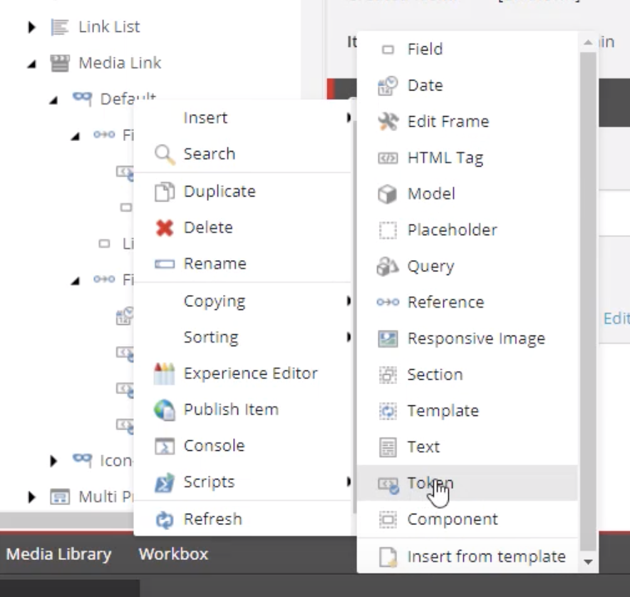
*SXA Rendering Variants Tokens, insert a token to a rendering variant*

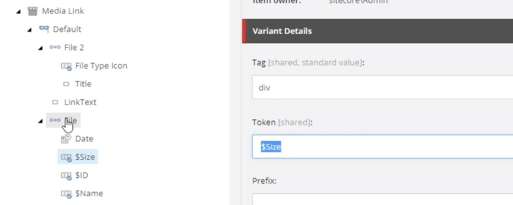
*SXA Rendering Variants Tokens, here is an example of a rendering variant set up with tokens*

Here is sitecores documentation about how to [Create a Custom Token for a Rendering Variant](https://doc.sitecore.com/developers/sxa/18/sitecore-experience-accelerator/en/create-a-custom-token-for-a-rendering-variant.html)
</details>
<details>
<summary>Part 8 - Basics Revisited</summary>
<br />  

Link to YouTube video for this section [SXA Rendering Variants Part 8 - Basics Revisited](https://youtu.be/VwfcV6JLW1w)

*Let's revisit some basics of rendering variants*

In the first *Rendering Variants - Basics* video, the rendering variant types were not covered well, so let's do that now.

* Section - A wrapper that allows you to put additional elements inside of them. It will wrap any elements in a tag that you get to specify, it can have styles applied to it, and additional attributes.
* Field - The field will render your content according to the type itself i.e. an image field will render an image, rich-text will allow you to edit content, a title will render text
* Text - Variant text is for specifying text constants, i.e. *Author*
* Date - Will render the date and there are many date formats available
* HTML Tag - A set of self-closing HTML tags that cannot contain any other tags within it

Most of the rendering variant types have the ability to add *Data attributes* which will be added (inline) to the HTML Tag that is specified for the rendering variant. Some rendering variant types also have fields for Prefix or Suffix content which allows additional content to be defined before or after the element.

[Here is the complete list of Rendering Variants and what they do and are used for](https://doc.sitecore.com/developers/sxa/17/sitecore-experience-accelerator/en/create-a-rendering-variant.html)
</details>
</details>
<br />
<details>
<summary>SXA Extensions and Customization</summary>
<details>
<summary>Create Custom SXA Module - Social Feed</summary>
<br />  

Link to YouTube video for this section [Create Custom SXA Module - Social Feed](https://youtu.be/avuVlJ34BwU)

*It's always better to clone an existing component rather than using the existing component*

It is recommended to clone an existing component because there is a folder structure to a component and it is easier to modify a clone than to make all of the required folders and files from scratch. The component to copy for this tutorial is the *Promo* component. Find the *Promo* component in sitecores folder tree, right-click the name, then ```Scripts > Clone Rendering```.

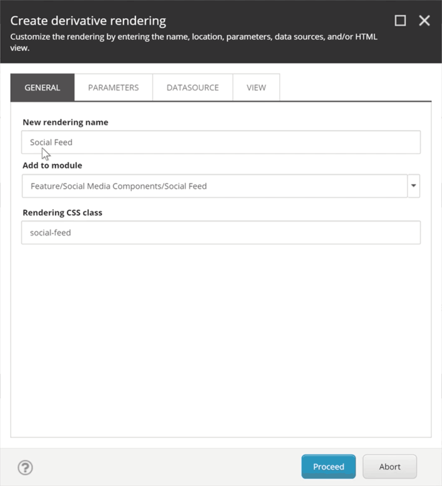
*SXA Extensions and Customization, clone an existing component and use the wizard to configure the component clone*

The cloning process will create a full blown component, which may need to be cleaned up after it has been cloned. For example, if you look at the component itself, in this case the *Promo* clone, you will find that there are a lot of settings related to the original *Promo* that you would like to change. For the social media component configuration, there is the configuration of the component itself, and the configuration of the rendering as seen in the screenshots below.

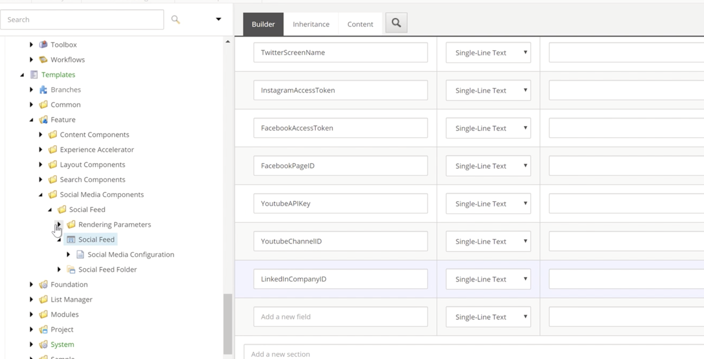
*SXA Extensions and Customization, custom module configuration. The field settings are specific to the Social Feed component that is being created*

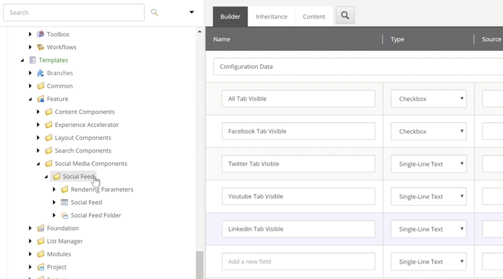
*SXA Extensions and Customization, custom module render configuration. The field settings are specific to the Social Feed component that is being created*

Now that the component and it's base render settings have been configured, the layout rendering should be configured as well. ``` sitecore > layout > Renderings > Feature > *custom_component*``` The presenter launches VSCode and has a completed component ready to go. What would appear to be the BED work for a custom component is presented. There are a lot of methods and constructors called, the section from [8:29 - 16:34](https://youtu.be/avuVlJ34BwU?t=509)(link starts at 8:29 mark) covers the implementation in VSCode. The component implementation is brief yet comprehensive. Additional learning would be useful for this one. At the very end of the video, the presenter states, "most of the work is done in the backend to create the controller".

For additional documentation, please refer to the sitecore docs on how to [create a new SXA module](https://doc.sitecore.com/developers/sxa/17/sitecore-experience-accelerator/en/create-a-new-sxa-module.html)

And here's a nice article following the flow of [creating a custom SXA component](http://blog.martinmiles.net/post/creating-custom-sxa-components-with-rendering-variants-and-almost-no-codebehind-on-an-example-of-social-share-buttons)
</details>
<details>
<summary>Custom Field Type General Link with Phone</summary>
<br />  

Link to YouTube video for this section [Custom Field Type General Link with Phone](https://youtu.be/k8SsfV9DhoU)

*Add support for additional link types in custom fields*

This section is quite backend heavy, so here's another link to [read all about creating a custom field type](https://ggullentops.blogspot.com/2019/04/sitecore-sxa-custom-rendering-variant-translation.html).

Most of what is done in this particular video is copying the code for the *General Link* field type and adding additional fields to handle phone numbers. The presenter recommends looking through the code and duplicating the patterns within to add your custom field types. The link above dives into the same.
</details>
<details>
<summary>Search Non Page Items in SXA</summary>
<br />  

Link to YouTube video for this section [Search Non Page Items in SXA](https://youtu.be/sonYfC9I8eU)

*The problem with SXA solo search is that it only searches content that's coming from pages or media types*

The example scenario is a few PDF items that aren't able to be included in search results. The proposed solution is as follows:

* Create a new search aggregator ```TAMM.XA.Foundation.Search```

* Update the sxacontent computed field in ```App_Config/Include/Z.Foundation.Overrides/Sitecore.XA.Foundation.Search.Solr.config``` to use this aggregator ```TAMM.XA.Foundation.Search``` instead of the default

* ```<field fieldName="sxacontent" returnType="textCollection" type="TAMM.XA.Foundation.Search.AggregatedContent, TAMM.XA.Foundation.Search"> <mediaIndexing ref="contentSearch/indexConfigurations/defaultSolrIndexConfiguration/mediaIndexing"/></field>```

This is another backend heavy section. [Watch the video](https://youtu.be/sonYfC9I8eU)
</details>
<details>
<summary>NVelocity Extensions</summary>
<br />  

Link to YouTube video for this section [NVelocity Extensions](https://youtu.be/foq2fkF5ITc)

*How to use NVelocity Extensions to create new Rendering Variants that are not available out of the box*

The scenario being explored in this video is the creation of an event page that renders a collection of event cards and also shows whether the event is *Today* or *Upcoming* by comparing the date of the event to the current date. The *Rendering Variant* is set up as in the following screenshot:

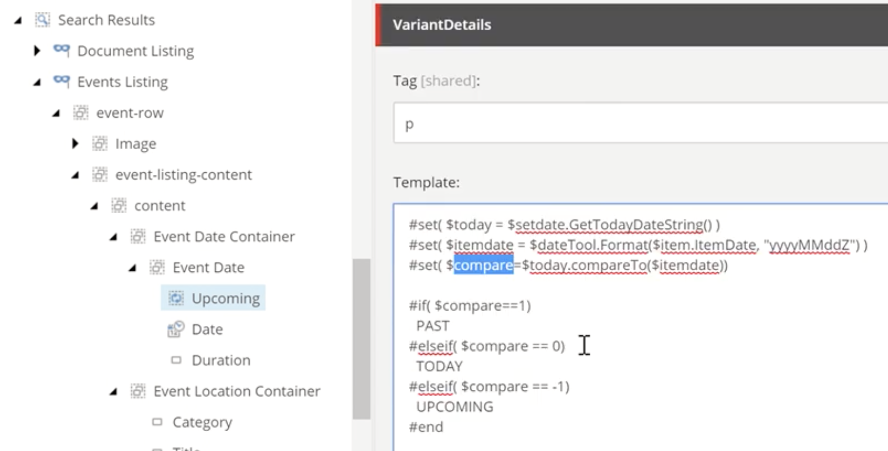
*SXA Extensions and Customization, set up a rendering variant template field*

The rest of the process takes place in the backend space, but here is some additional reading for the curious:

For a well-written explaination of NVelocity Extensions, chcekout [NVelocity Templates with SXA](https://olmecdev.com/2019/The-SXA-Way-Using-NVelocity-Templates/)

Another article about [Sitecore SXA: Using Placeholders with NVelocity Templates](https://www.sitecorenutsbolts.net/2018/10/23/Sitecore-SXA-Using-Placeholders-with-NVelocity-Templates/)

*most of the results when searching for 'SXA NVelocity Extensions' return results talking about 'NVelocity Templates', maybe 'Templates' is the correct term?*
</details>
<details>
<summary>Customize the XA RTE Profile</summary>
<br />  

Link to YouTube video for this section [Customize the XA RTE Profile](https://youtu.be/SZvIOXjOn8A)

*How to add different classes to our text directly from the RTE editor*

This is 🔥, just follow this path in your folder tree ```... Settings > Html Editor Profiles > Right Text XA > Paragraphs``` and add a new type, name it whatever is appropriate. In the *Content* section of the screen for the new RTE style, in the *Data* section, define the *Header* and *Value* fields. *Header* is the name of the style, *Value* is the HTML wrapper including any classes you would like to apply.

Another way to add styles to the RTE is to add values to the dropdown list for the RTE in the backend, then add the CSS to the default.css file associated with the RTE.

I'm not convinced that either way... well maybe the first approach seems more reasonable / future proof, but here is an additional reading:

Approach #2, touching core files... [Adding Custom CSS Class to Sitecore RTE](https://therelentlessfrontend.com/2018/03/15/adding-custom-css-class-to-sitecore-rich-text-editor/)
</details>
</details>
<br />

[Custom Component Build - Part 1 - Introduction](https://www.nishtechinc.com/en/Blog/2018/November/Nuptial-Experiment-Introduction)

[Custom Component Build - Part 2 - Milestone 1](https://www.nishtechinc.com/en/Blog/2018/November/Nuptial-Experiment-Part-2)

[Custom Component Build - Part 3 - Milestones 2 & 3](https://www.nishtechinc.com/en/Blog/2018/November/Nuptial-Experiment-Part-3)

[Custom Component Build - Part 4 - Final Thoughts](https://www.nishtechinc.com/en/Blog/2018/November/Nuptial-Experiment-Final-Thoughts)

[SXA Overview Part 1](https://www.velir.com/blog/2017/10/16/tour-sitecore-experience-accelerator-sxa-part-1)

[SXA Overview Part 2](https://www.velir.com/blog/2017/10/16/tour-sitecore-experience-accelerator-sxa-part-2)

[SXA Implementation - Some Tips & Tricks](https://www.sidewalk.be/articles/the-sitecore-sxa-journey-discover-tips-and-tricks-when-implementing-an-sxa-website)

[Video Tutorial Walkthrough](https://www.reddit.com/r/sitecore/comments/bdihvd/sitecore_sxa_tutorials_sxa_1_8_full_site_step_by/)

[Add data attributes to renderings](http://blog.martinmiles.net/post/how-to-add-id-and-data-attributes-to-a-rendering-variant-in-sxa)

## Random Junk & Garbage

A Collection of [UI Design Tips](https://twitter.com/i/moments/994601867987619840)

Make your code snippet screenshots look pretty with [Carbon](https://carbon.now.sh/)

[A Script](https://github.com/minamarkham/formation) to set up a new Laptop with all the Things

[ES6 In Depth](https://hacks.mozilla.org/category/es6-in-depth/) - Brought to you by Mozilla

[Add or Remove classes on things w/ Jquery?](http://jsfiddle.net/ak9Lnrjj/10/)  
*could be a fix for slick carousel variable height slides. add a class that makes all the other slides have```css display: none;```* 

[Charles - Web Debugging Proxy Application](https://www.charlesproxy.com)

[CSS Architecture](https://philipwalton.com/articles/css-architecture/)

[Objects in Space](https://medium.com/objects-in-space/objects-in-space-f6f404727) - A style-guide for modular SASS development using SMACSS and BEM

## Ewwww SVG

*read in order*

[A Primer to Frontend SVG Hacking :D](https://dbushell.com/2013/02/04/a-primer-to-front-end-svg-hacking/)

[Optimizing SVGs in Data URIs](https://codepen.io/tigt/post/optimizing-svgs-in-data-uris)

[Data URI Generator](https://dopiaza.org/tools/datauri/index.php)

[URL Encoder](https://www.urlencoder.org/)

## JavaScript

[Essential JavaScript Design Patterns](https://addyosmani.com/resources/essentialjsdesignpatterns/book/) - Complete Book
